# GT CS Junior Design Group 1332 Project - Distal Radius Implant Identifer

## Premise and Motivation
This product aims to provide a quick and easy way for surgeons to identify the manufacturer and model of the implant a patient has to have to better prepare them for the surgery ahead.

The reason we cannot use an “off-the-shelf” product for this is that no current software item is capable of identifying the specific plates and screws involved in a distal radius implant. 

Our product will be targeted directly at distal radius implants, allowing the model to be specialized incredibly tightly. This will make our model much more accurate in training and predictions. In addition, this will be built using computer vision, mobile application, and machine learning technologies allowing for a long lifespan and continuous support and maintenance for many years, even once the project leaves our group’s hands.

## Release Notes (v1.0)
#### Software Features
- This application recognizes the model and manufacturer of distal-radius implants.
- The application has an immersive tutorial that walks the user through the application step-by-step. The first launch opens automatically to the tutorial. The tutorial can be accessed again through the info button, and also allows for the user to swipe back and forth between steps, in case the user needs to refresh their memory of a specific feature.
- The home page has an Info button in the top-right corner, when clicked, the user can go to the FAQ page or walk through the tutorial again.
- To use the application, it is necessary to use the phone's camera. We have embedded the use of the camera into the app. The app asks for permission to access the camera on the first launch. The application doesn't save images to the phones photo library. The photos are only saved within the runtime of the application. If the application is force closed, the photos are lost.

#### Bug Fixes
- Users are correctly asked for camera permissions when the app is first opened. This now displays an alert redirecting users to the settings page to allow camera access for those who have disabled it.
- Technique guides are now displayed correctly in the application.
- Error messages are now displayed correctly when API requests fail.

#### Known Bugs
- There is a bug in the SwiftUI runtime regarding lists and nested views in iPad devices. When selecting a row in a list on a different screen than the list, the list will not update. This causes the user to be routed back to the camera capture page, which is not ideal. This can be remedied by selecting on your results item from the sidebar, which will correctly route you to the results page.
- While images are being fetched, the words "no images" are displayed rather than a progress bar.
- On smaller devices, buttons become taller rather than resizing the text. This is due to the fact that the text is larger than the button size on iPhone 11, iPhone 12/13 Mini, and iPhone SE.


## Installation Guide
**NOTE:** This installation guide assumes the application is not uploaded to the App Store and you are building from source code  

#### Prerequisites
Download and install Xcode from Apple's App Store.

#### Installation

1. Open the .xcodeproj file within the DistalRadiusIdentifier directory.

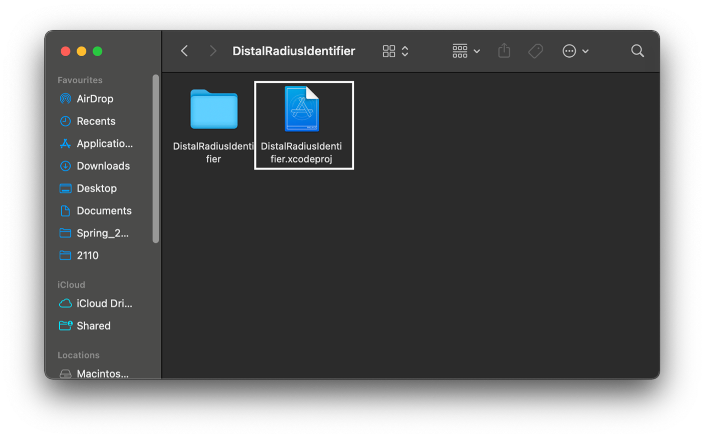

2. Double click on the root directory icon in Xcode (DistalRadiusIdentifier). In the window that pops up, choose Signing and Capabilities 

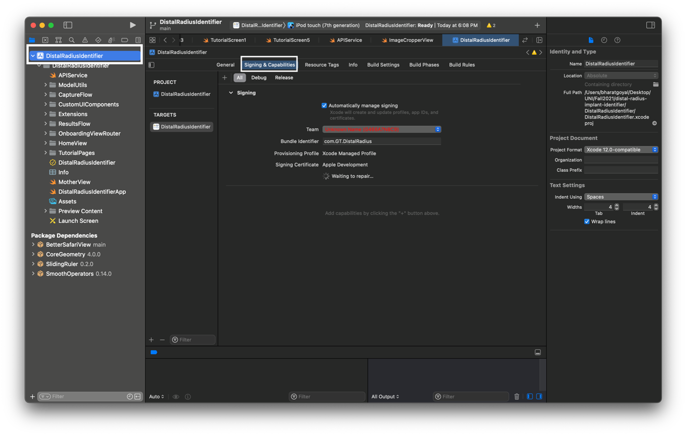

3. Click on the ‘Team’ dropdown box in that window and select ‘Add an Account’. After that, change the bundle identifier (it should be a unique identifier not in use by any other account, for instance the identifier in the image below would be invalid). 

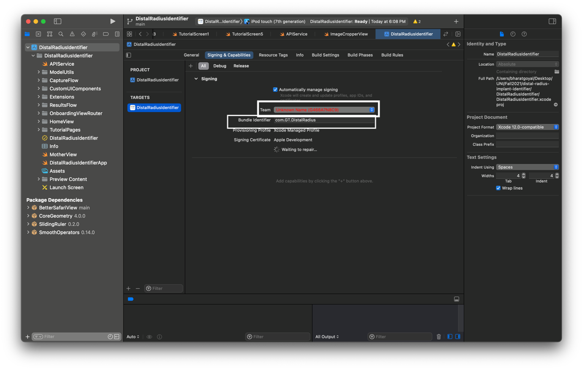

4. After that, click on the devices option at the top bar. In case you don’t see any device under ‘my devices’, connect the device you want to load the application on to. Then select that device. NOTE: camera capture is not supported via the Xcode simulator.  

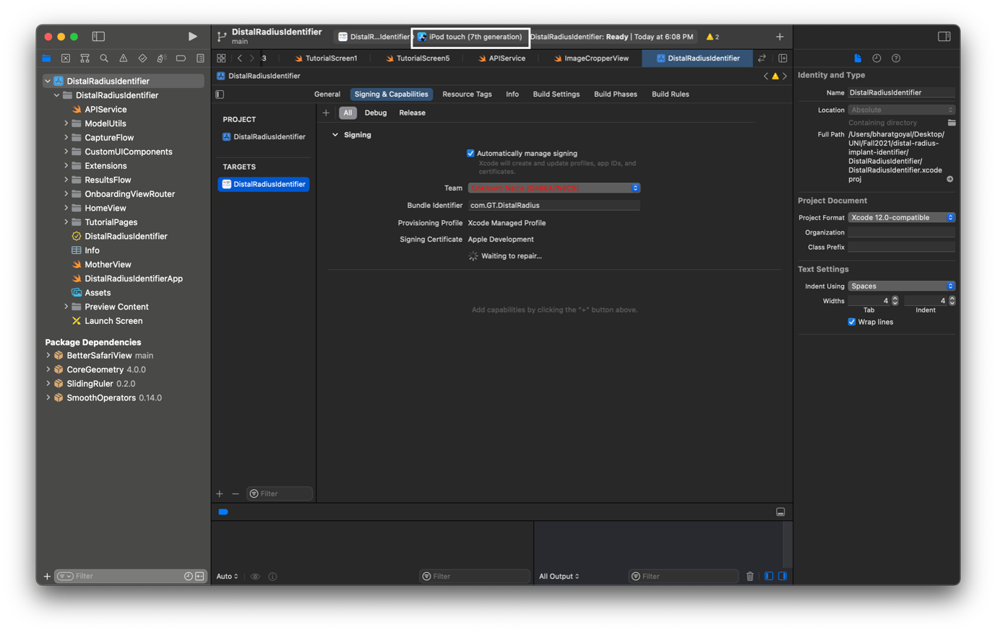

5. Once the device has been changed to the connected one, click on the play (build) button. This will load the application on to your device!

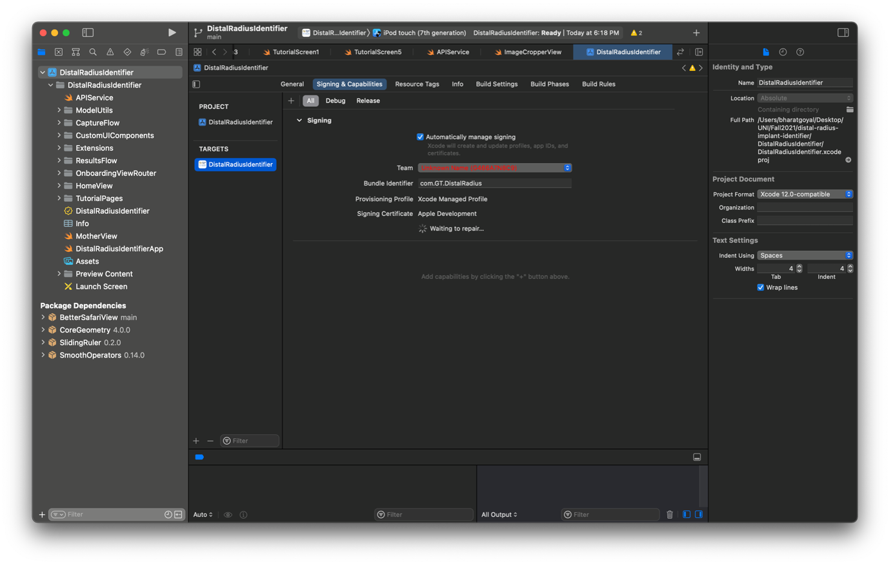

6. On the iPhone, go to Settings -> General -> VPN & Device Management -> Apple ID option selected in Xcode under team -> Trust.   

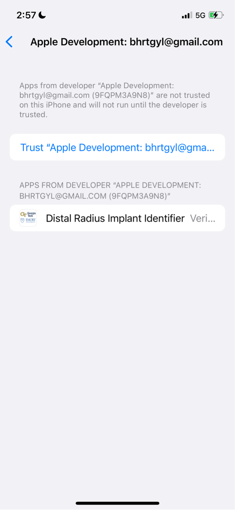


## Retraining the model

1. Pull the model from the main branch

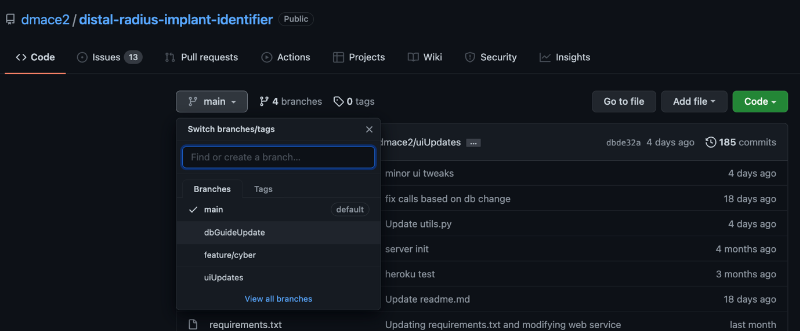

2. Create a local branch to track the main branch and pull the updated version of the branch onto your local system. In case the reader is unfamiliar with git, https://git-scm.com/doc may be a useful resource. 

### Environment setup

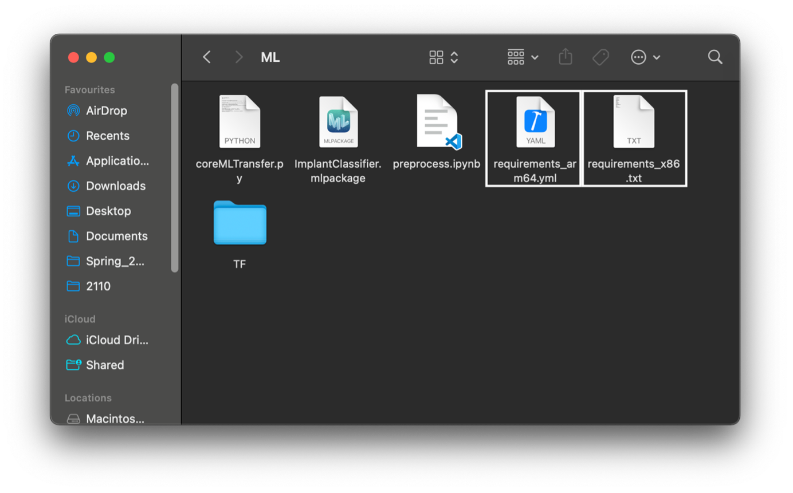

#### Apple Silicon Devices 

First step is to install [miniforge](https://github.com/conda-forge/miniforge). This will allow you to install conda packages from the conda-forge channel.

 
Navigate to the ML directory and use the requirements.yml file to create a conda environment (command below) 

```
conda env create −f requirements.yml
```
  

#### x86 Devices (all other Macs and PC devices) 

Install [anaconda](https://www.anaconda.com/download/) to your system.

Create your conda environment (the name DRenv has been suggested, but it can be anything and install requirements.txt:

```
conda create −−name DRenv
```
  
```
pip install −r requirements.txt
```
  

Once the environment has been created, it must be activated using the following command: 

```
conda activate [environment_name]
```

You can verify that the environment is active by running the following command: 

```
conda info
```

### Adding the Images Folder

Navigate to the ML folder and paste the updated images folder at this location. Note that the folder should have the same format as the google drive folder shared earlier (with x-rays segregated by manufacturer) To minimise the data stored on the server side, the images folder is not pushed to the GitHub repository.  

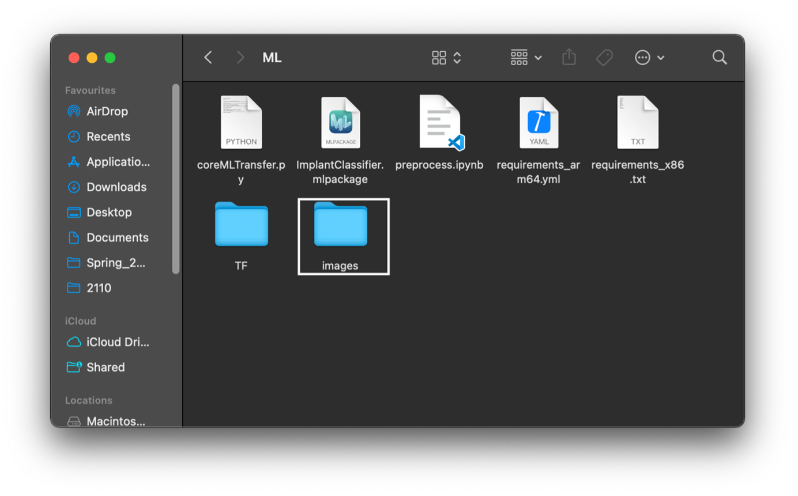


### Generating the New Model

Thereafter, go into the TF folder and run the imagenet_transfer.py script through the command line. This will create a folder called model within the TF folder (in case this folder already exists, it will get updated). Note that you need to be in the conda environment for this sequence of steps to work. 

```
cd [repo_path]/ML/TF
python imagenet_transfer.py
```

Once this folder has been created, navigate back to the ML directory (TF’s parent folder), and delete the images directory (this is to ensure that it isn’t accidentally pushed to the repository later). 

Thereafter, run the coreMLTransfer.py script. This will convert the model generating using Tensorflow into CoreML so that it can be used with Swift.  

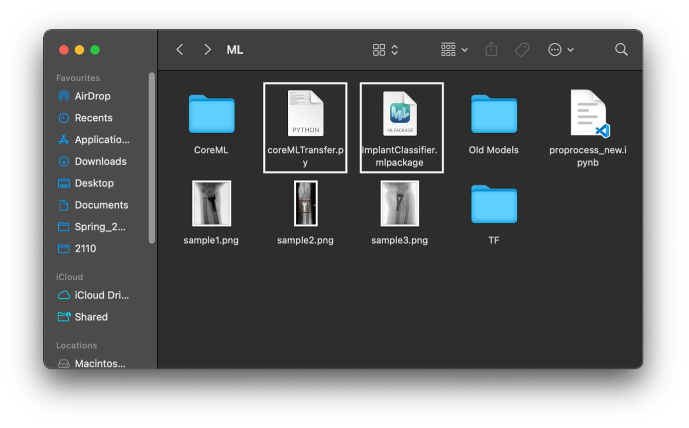

### Updating the Model for the App 

On running the coreMLTransfer.py script, the ‘ImplantClassifier.mlpackage’ file will get updated.  

Once the ImplantClassifier.mlpackage has been updated, all that needs to be done is copy it, navigate to the home directory of the repo (outside of ML), go into ‘DistalRadiusIdentifier/ DistalRadiusIdentifier/ModelUtils’ and replace the existing ImplantClassifier.mlpackage file at that location with the updated one.  

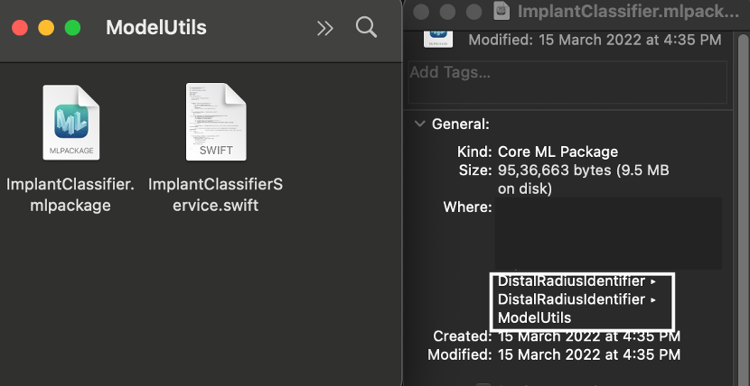

Once that is done, make sure only the following folders should be the only changes staged to be committed to the main branch:  

‘ImplantClassifier.mlpackage’ 

‘ML/TF/model’ 

‘DistalRadiusIdentifier/DistalRadiusIdentifier/ModelUtils’  

To deploy these changes to the app store, anyone with a developer account could push a new build of the app to the app store. If these changes are required on just a single device, the Xcode file could be run on an iPhone (explained in the Installation Guide instruction manual).


## Troubleshooting Common Installation Issues

1. If the app is not able to load on the device, try restarting the device.
2. If training the model errors with ModuleNotFoundError, try activating your conda environment again and rerunning the script.
3. If creating the conda environment fails, try installing each package individually using one of these two commands:
```
conda install [package_name]
```
```
pip install [package_name]
```

4. If 